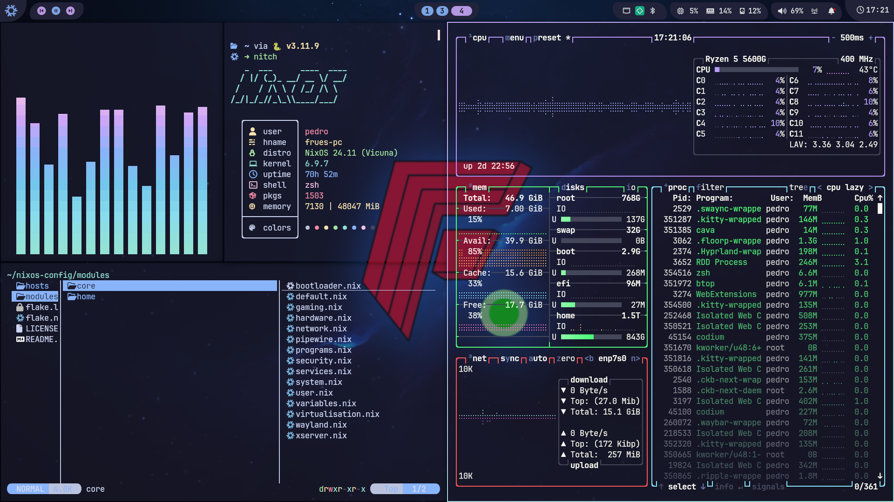

<h1 align="center">
   
    
        
   

      

      

         
         
      

       
   

</h1>

 

### 🖼️ Desktop config screenshots

     
   Screenshots last updated <b>27th December 2025</b>

# 🗃️ Overview

### 📚 Layout

This repo uses [clan](https://clan.lol), so that drives the repo structure a
lot. Check [their docs](https://docs.clan.lol) for more info.

- [flake.nix](flake.nix) ❄️ Where the magic begins
- [clan.nix](clan.nix) ⚙️ clan configuration
- [modules](modules) 🍱 modules reused accross various configurations
- [hosts](machines) 🌳 per-machine
- [users](users) 👥 user-specific configurations
  - [pedro/home-configuration](users/pedro/home-configuration) 🏠 my
    [Home-Manager](https://github.com/nix-community/home-manager) config

### 📓 Components

|                             |                                  NixOS + Hyprland                                   |
| --------------------------- | :---------------------------------------------------------------------------------: |
| **Window Manager**          |                                [Hyprland][Hyprland]                                 |
| **Bar**                     |                                  [Waybar][Waybar]                                   |
| **Application Launcher**    |                                  [fuzzel][fuzzel]                                   |
| **Notification Daemon**     |                                    [mako][mako]                                     |
| **Terminal Emulator**       |                                   [Kitty][Kitty]                                    |
| **Shell**                   |             [zsh][zsh] + [oh-my-zsh][oh-my-zsh] + [Starship][Starship]              |
| **Text Editor**             |                                   [Helix][helix]                                    |
| **network management tool** | [NetworkManager][NetworkManager] + [network-manager-applet][network-manager-applet] |
| **System resource monitor** |                                    [Btop][Btop]                                     |
| **File Manager**            |                             [nemo][nemo] + [yazi][yazi]                             |
| **Fonts**                   |                              [Nerd fonts][Nerd fonts]                               |
| **Color Scheme**            |                   [Catppuccin][Catppuccin] with [stylix][stylix]                    |
| **Cursor**                  |                      [Catppuccin cursors][catppuccin-cursors]                       |
| **Icons**                   |              [catppuccin-papirus-folders][catppuccin-papirus-folders]               |
| **Lockscreen**              |                                [hyprlock][hyprlock]                                 |
| **Image Viewer**            |                                   [vimiv][vimiv]                                    |
| **Media Player**            |                                     [mpv][mpv]                                      |
| **Music Player**            |                          [spotify_player][spotify_player]                           |
| **Screenshot Software**     |                               [grimblast][grimblast]                                |
| **Screen Recording**        |                             [wf-recorder][wf-recorder]                              |
| **Clipboard**               |                         [wl-clip-persist][wl-clip-persist]                          |
| **Color Picker**            |                              [hyprpicker][hyprpicker]                               |

# 👥 Credits

- This repo is ported (altough not that much stuff was mantained) from my
  [nixos-config](https://git.peprolinbot.com/peprolinbot/nixos-config) repo, so
  check the
  [credits there](https://git.peprolinbot.com/peprolinbot/nixos-config#credits)
  too.

- The [FruesOS logo](.repo/assets/logo/fruesos-logo.png) and Frues logo
  (included in
  [this wallpaper](users/pedro/home-configuration/hyprland/default_wallpaper.png))
  © 2025 by Pedro Rey Anca (peprolinbot) are licensed under
  [CC BY-NC-ND 4.0](https://creativecommons.org/licenses/by-nc-nd/4.0/)

Please open an issue if i forgot to credit you.

<!-- end of page, send back to the top -->

  <a href="#readme">Back to the Top</a>

<!-- Links -->

[Hyprland]: https://github.com/hyprwm/Hyprland
[Kitty]: https://github.com/kovidgoyal/kitty
[Starship]: https://github.com/starship/starship
[Waybar]: https://github.com/Alexays/Waybar
[fuzzel]: https://codeberg.org/dnkl/fuzzel
[Btop]: https://github.com/aristocratos/btop
[nemo]: https://github.com/linuxmint/nemo
[yazi]: https://github.com/sxyazi/yazi
[zsh]: https://ohmyz.sh/
[oh-my-zsh]: https://ohmyz.sh/
[hyprlock]: https://github.com/hyprwm/hyprlock
[spotify_player]: https://github.com/aome510/spotify-player
[mpv]: https://github.com/mpv-player/mpv
[helix]: https://github.com/helix/helix
[grimblast]: https://github.com/hyprwm/contrib
[vimiv]: https://karlch.github.io/vimiv/
[mako]: https://github.com/emersion/mako
[Nerd fonts]: https://github.com/ryanoasis/nerd-fonts
[NetworkManager]: https://wiki.gnome.org/Projects/NetworkManager
[network-manager-applet]: https://gitlab.gnome.org/GNOME/network-manager-applet/
[wl-clip-persist]: https://github.com/Linus789/wl-clip-persist
[wf-recorder]: https://github.com/ammen99/wf-recorder
[hyprpicker]: https://github.com/hyprwm/hyprpicker
[Catppuccin]: https://github.com/catppuccin/catppuccin
[catppuccin-papirus-folders]: https://github.com/catppuccin/papirus-folders
[catppuccin-cursors]: https://github.com/catppuccin/cursors
[maxfetch]: https://github.com/jobcmax/maxfetch
[stylix]: https://github.com/nix-community/stylix
