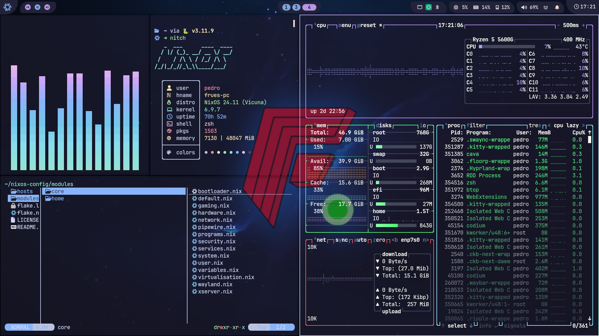
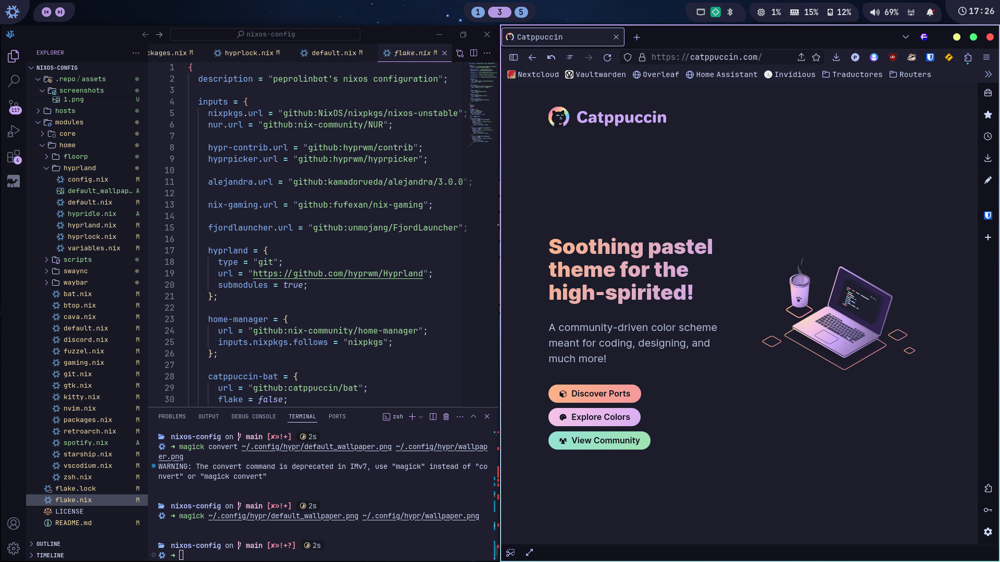

<h1 align="center">
    
   <br>
      peprolinbot's Flakes 
   <br>
       <br>
   <div align="center">

   <div align="center">
      <p></p>
      <div align="center">
         <a = href="https://nixos.org">
            
         </a>
         <a href="https://github.com/Frost-Phoenix/nixos-config/blob/main/LICENSE">
            
         </a>
      </div>
      <br>
   </div>
</h1>

<br>
</div>

### 🖼️ Gallery

<p align="center">
    <br>
    <br>
   Screenshots last updated <b>8th July 2024</b>
</p>

# 🗃️ Overview

### 📚 Layout

-   [flake.nix](flake.nix) base of the configuration
-   [hosts](hosts) 🌳 per-host configurations that contain machine specific configurations
-   [modules](modules) 🍱 modularized NixOS configurations
    -   [core](modules/core/) ⚙️ Core NixOS configuration
    -   [homes](modules/home/) 🏠 my [Home-Manager](https://github.com/nix-community/home-manager) config

### 📓 Components
|                             | NixOS + Hyprland                                                                              |
| --------------------------- | :---------------------------------------------------------------------------------------------:
| **Window Manager**          | [Hyprland][Hyprland] |
| **Bar**                     | [Waybar][Waybar] |
| **Application Launcher**    | [fuzzel][fuzzel] |
| **Notification Daemon**     | [swaync][swaync] |
| **Terminal Emulator**       | [Kitty][Kitty] |
| **Shell**                   | [zsh][zsh] + [oh-my-zsh][oh-my-zsh] + [Starship][Starship] |
| **Text Editor**             | [VSCodium][VSCodium] + [Neovim][Neovim] |
| **network management tool** | [NetworkManager][NetworkManager] + [network-manager-applet][network-manager-applet] |
| **System resource monitor** | [Btop][Btop] |
| **File Manager**            | [nemo][nemo] + [yazi][yazi] |
| **Fonts**                   | [Nerd fonts][Nerd fonts] |
| **Color Scheme**            | [Catppuccin][Catppuccin] |
| **Cursor**                  | [Nordzy-cursors][Nordzy-cursors] |
| **Icons**                   | [catppuccin-papirus-folders][catppuccin-papirus-folders] |
| **Lockscreen**              | [hyprlock][hyprlock] |
| **Image Viewer**            | [imv][imv] |
| **Media Player**            | [mpv][mpv] |
| **Music Player**            | [audacious][spotify_player] |
| **Screenshot Software**     | [grimblast][grimblast] |
| **Screen Recording**        | [wf-recorder][wf-recorder] |
| **Clipboard**               | [wl-clip-persist][wl-clip-persist] |
| **Color Picker**            | [hyprpicker][hyprpicker] |


### 📝 Shell aliases

<details>
<summary>
Utils (EXPAND)
</summary>

- ```c```     $\rightarrow$ ```clear```
- ```cd```    $\rightarrow$ ```z```
- ```tt```    $\rightarrow$ ```gtrash put```
- ```vim```   $\rightarrow$ ```nvim```
- ```cat```   $\rightarrow$ ```bat```
- ```nano```  $\rightarrow$ ```micro```
- ```icat```  $\rightarrow$ ```kitten icat```
- ```dsize``` $\rightarrow$ ```du -hs```
- ```findw``` $\rightarrow$ ```grep -rl```
- ```l```     $\rightarrow$ ```eza --icons  -a --group-directories-first -1```
- ```ll```    $\rightarrow$ ```eza --icons  -a --group-directories-first -1 --no-user --long```
- ```tree```  $\rightarrow$ ```eza --icons --tree --group-directories-first```
</details>

<details>
<summary>
Nixos (EXPAND)
</summary>

> ${host} is either `desktop` or `laptop`

- ```cdnix```            $\rightarrow$ ```cd ~/nixos-config && codium ~/nixos-config```
- ```ns```               $\rightarrow$ ```nix-shell --run zsh```
- ```nix-switch```       $\rightarrow$ ```sudo nixos-rebuild switch --flake ~/nixos-config#${host}```
- ```nix-switchu```      $\rightarrow$ ```sudo nixos-rebuild switch --upgrade --flake ~/nixos-config#${host}```
- ```nix-flake-update``` $\rightarrow$ ```sudo nix flake update ~/nixos-config#```
- ```nix-clean```        $\rightarrow$ ```sudo nix-collect-garbage && sudo nix-collect-garbage -d && sudo rm /nix/var/nix/gcroots/auto/* && nix-collect-garbage && nix-collect-garbage -d```
</details>

<details>
<summary>
Git (EXPAND)
</summary>

- ```ga```   $\rightarrow$ ```git add```
- ```gaa```  $\rightarrow$ ```git add --all```
- ```gs```   $\rightarrow$ ```git status```
- ```gb```   $\rightarrow$ ```git branch```
- ```gm```   $\rightarrow$ ```git merge```
- ```gpl```  $\rightarrow$ ```git pull```
- ```gplo``` $\rightarrow$ ```git pull origin```
- ```gps```  $\rightarrow$ ```git push```
- ```gpso``` $\rightarrow$ ```git push origin```
- ```gc```   $\rightarrow$ ```git commit```
- ```gcm```  $\rightarrow$ ```git commit -m```
- ```gch```  $\rightarrow$ ```git checkout```
- ```gchb``` $\rightarrow$ ```git checkout -b```
- ```gcoe``` $\rightarrow$ ```git config user.email```
- ```gcon``` $\rightarrow$ ```git config user.name```
</details>

### 🛠️ Scripts

All the scripts are in ```modules/home/scripts/scripts/``` and are exported as packages in ```modules/home/scripts/default.nix```

<details>
<summary>
extract.sh 
</summary>

**Description:** This script extract ```tar.gz``` archives in the current directory.

**Usage:** ```extract <archive_file>```
</details>

<details>
<summary>
compress.sh 
</summary>

**Description:** This script compress a file or a folder into a ```tar.gz``` archives which is created in the current directory with the name of the chosen file or folder. 

**Usage:** ```compress <file>``` or ```compress <folder>```
</details>

<details>
<summary>
toggle_blur.sh 
</summary>

**Description:** This script toggles the Hyprland blur effect. If the blur is currently enabled, it will be disabled, and if it's disabled, it will be turned on. 

**Usage:** ```toggle_blur```
</details>

<details>
<summary>
toggle_oppacity.sh 
</summary>

**Description:** This script toggles the Hyperland oppacity effect. If the oppacity is currently set to 0.90, it will be set to 1, and if it's set to 1, it will be set to 0.90. 

**Usage:** ```toggle_oppacity```
</details>

<details>
<summary>
runbg.sh 
</summary>

**Description:** This script runs a provided command along with its arguments and detaches it from the terminal. Handy for launching apps from the command line without blocking it. 

**Usage:** ```runbg <command> <arg1> <arg2> <...>```
</details>

### ⌨️ Keybinds

View all keybinds by pressing ```$mainMod F1```. By default ```$mainMod``` is the ```SUPER``` key. 

# 🚀 Installation 

> **⚠️ Use this configuration at your own risk! ⚠️** <br>
> Applying custom configurations, especially those related to your operating system, can have unexpected consequences and may interfere with your system's normal behavior. While I have tested these configurations on my own setup, there is no guarantee that they will work flawlessly on all systems. <br>
> **I am not responsible for any issues that may arise from using this configuration.**

> It is highly recommended to review the configuration contents and make necessary modifications to customize it to your needs before attempting the installation. Especially if you consider that I only use this on my own systems and I make almost no efforts for this to be used by anyone other than me.

1. **Install NixOs**

   First install nixos using any [graphical ISO image](https://nixos.org/download.html#nixos-iso). 
   > Only been tested using the Gnome graphical installer and choosing the ```No desktop``` option durring instalation.

2. **Clone the repo**

   ```
   nix-shell -p git
   git clone https://git.peprolinbot.com/peprolinbot/nixos-config
   cd nixos-config
   ```

2. **Customize**
   Read everything (as much as you can anyway) and edit what you consider neccesary.

3. **Install**

   Run `sudo nixos-rebuild switch --flake .` and fix any errors that might arise

4. **Reboot**

   After rebooting, you'll be greeted by regreet prompting for your password.

# 👥 Credits

Heavily based on [Frost-Phoenix's Flakes](https://github.com/Frost-Phoenix/nixos-config). And therefore, recursively, also:

- Nix Flakes
  - [nomadics9/NixOS-Flake](https://github.com/nomadics9/NixOS-Flake): This is where I start my nixos / hyprland journey.
  - [samiulbasirfahim/Flakes](https://github.com/samiulbasirfahim/Flakes): General flake / files structure
  - [justinlime/dotfiles](https://github.com/justinlime/dotfiles): Mainly waybar (old design)
  - [skiletro/nixfiles](https://github.com/skiletro/nixfiles): Vscodium config (that prevent it to crash)
  - [fufexan/dotfiles](https://github.com/fufexan/dotfiles)

- README
  - [ryan4yin/nix-config](https://github.com/ryan4yin/nix-config)
  - [NotAShelf/nyx](https://github.com/NotAShelf/nyx)
  - [sioodmy/dotfiles](https://github.com/sioodmy/dotfiles)
  - [Ruixi-rebirth/flakes](https://github.com/Ruixi-rebirth/flakes)

Please open an issue if i forgot to credit you.

<!-- end of page, send back to the top -->

<div align="right">
  <a href="#readme">Back to the Top</a>
</div>

<!-- Links -->
[Hyprland]: https://github.com/hyprwm/Hyprland
[Kitty]: https://github.com/kovidgoyal/kitty
[Starship]: https://github.com/starship/starship
[Waybar]: https://github.com/Alexays/Waybar
[fuzzel]: https://codeberg.org/dnkl/fuzzel>
[Btop]: https://github.com/aristocratos/btop
[nemo]: https://github.com/linuxmint/nemo
[yazi]: https://github.com/sxyazi/yazi
[zsh]: https://ohmyz.sh/
[oh-my-zsh]: https://ohmyz.sh/
[hyprlock]: https://github.com/hyprwm/hyprlock
[spotify_player]: https://github.com/aome510/spotify-player
[mpv]: https://github.com/mpv-player/mpv
[VSCodium]:https://vscodium.com/
[Neovim]: https://github.com/neovim/neovim
[grimblast]: https://github.com/hyprwm/contrib
[imv]: https://sr.ht/~exec64/imv/
[swaync]: https://github.com/ErikReider/SwayNotificationCenter
[Nerd fonts]: https://github.com/ryanoasis/nerd-fonts
[NetworkManager]: https://wiki.gnome.org/Projects/NetworkManager
[network-manager-applet]: https://gitlab.gnome.org/GNOME/network-manager-applet/
[wl-clip-persist]: https://github.com/Linus789/wl-clip-persist
[wf-recorder]: https://github.com/ammen99/wf-recorder
[hyprpicker]: https://github.com/hyprwm/hyprpicker
[Catppuccin]: https://github.com/catppuccin/catppuccin
[catppuccin-papirus-folders]: https://github.com/catppuccin/papirus-folders
[Nordzy-cursors]: https://github.com/alvatip/Nordzy-cursors
[maxfetch]: https://github.com/jobcmax/maxfetch
